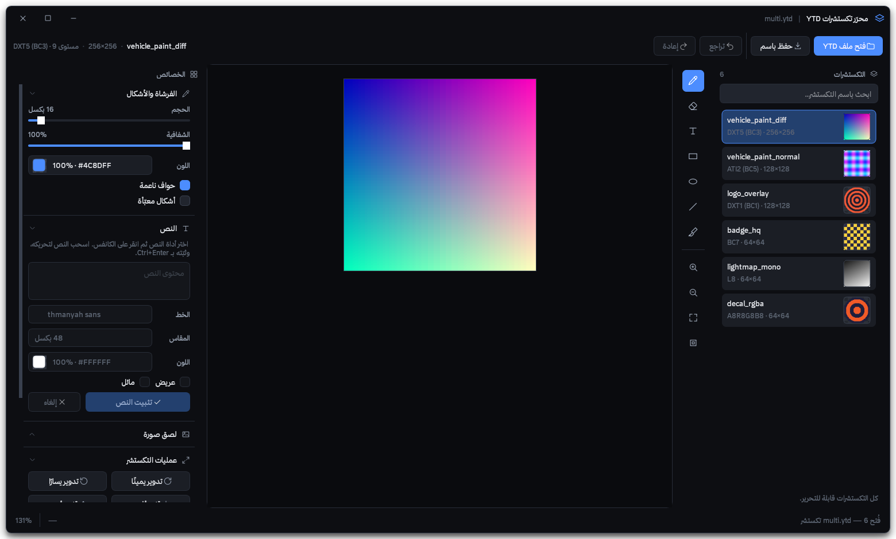

<div align="center">

# YTD Texture Editor

**A desktop image editor for GTA V / FiveM `.ytd` texture dictionaries.**

Open a `.ytd`, paint on its textures, drop text and images onto them, and save
a new, valid `.ytd` you can put straight into a FiveM resource.

[](https://www.python.org/)
[](https://doc.qt.io/qtforpython/)
[](https://numpy.org/)
[](#installation)
[](../LICENSE)

</div>



```
Open .ytd  ->  select texture  ->  draw / add text / place an image  ->  Save As YTD
```

---

## Contents

- [Why this exists](#why-this-exists)
- [Features](#features)
- [Installation](#installation)
- [Running](#running)
- [The workflow](#the-workflow)
- [Uploading a picture](#uploading-a-picture)
- [Shortcuts](#shortcuts)
- [Supported texture formats](#supported-texture-formats)
- [How the YTD support works](#how-the-ytd-support-works)
- [Limitations](#limitations)
- [Troubleshooting](#troubleshooting)
- [Project structure](#project-structure)
- [Using the core headlessly](#using-the-core-headlessly)
- [Contributing](#contributing)
- [Credits](#credits)
- [License](#license)

---

## Why this exists

Editing a texture inside a `.ytd` normally means a three-tool round trip:
export the DDS with one tool, edit it in another, re-import with a third, and
hope the dictionary still loads in game.

This does all of it in one window, and — importantly — **without rebuilding the
resource**. Only the pixel bytes you actually changed get written; every name,
hash, pointer and untouched texture is preserved byte-for-byte. See
[How the YTD support works](#how-the-ytd-support-works).

---

## Features

### YTD handling
- Reads every texture in a dictionary: name, dimensions, format, mip count
- Preserves names, hashes, structure and unedited textures **byte-for-byte**
- Writes a new valid `.ytd`, and **re-parses the result before writing it**
- Never overwrites your original unless you explicitly ask it to
- Export a single texture to PNG, or to DDS with its original surface bytes

### Canvas
- Native-resolution editing — zoom 2%–6400%, pan, fit, reset
- Nearest-neighbour magnification so texels stay crisp
- Full alpha support with a transparency checkerboard
- 40 levels of undo/redo

### Tools
- **Brush** — size, colour, opacity, optional smoothing. Strokes are built on
  their own layer and composited once on release, so overlapping segments in a
  single stroke don't stack up into a darker blob.
- **Eraser** — erases to true transparency
- **Text** — any installed font, size, colour, bold/italic; movable, editable,
  removable, baked in only when you confirm
- **Upload image** — place a picture as a floating layer: drag to move, drag a
  corner to resize, exact width/height/position fields, opacity, aspect lock
- **Rect / Ellipse / Line** — filled or outlined
- **Colour picker**
- Clear, rotate, flip, resize, crop, replace a texture with an image
- Revert any texture to its original state at any time

---

## Installation

Requires **Python 3.11 or newer** (developed and tested on 3.12).

```bash
git clone https://github.com/<your-user>/<your-repo>.git
cd <your-repo>/ytd_editor
pip install -r requirements.txt
```

| Package | Version | Why |
|---|---|---|
| `PySide6` | >= 6.6 | the Qt 6 user interface |
| `numpy` | >= 1.24 | texture encoding / decoding |
| `Pillow` | >= 10.0 | PNG/JPG import-export and BC7 decoding |

> [!NOTE]
> Pillow **9.4+** is the hard minimum for BC7 decoding; 10.0 is pinned to stay
> comfortably clear of it.

If a dependency is missing, the app tells you which one and why instead of
dying with a raw `ImportError`.

<details>
<summary><b>Using a virtual environment (recommended)</b></summary>

```bash
python -m venv .venv

# Windows
.venv\Scripts\activate
# Linux / macOS
source .venv/bin/activate

pip install -r requirements.txt
```
</details>

---

## Running

```bash
cd ytd_editor
python main.py
```

or from the parent folder:

```bash
python -m ytd_editor.main
```

You can also pass a file directly:

```bash
python main.py path/to/vehicle.ytd
```

---

## The workflow

1. **Open YTD** (`Ctrl+O`) and pick a `.ytd`.
2. The left sidebar fills with every texture in the dictionary — thumbnails,
   names, dimensions and format. Click one to load it.
3. Edit it:
   - **Brush** (`B`) — size, colour, opacity
   - **Eraser** (`E`) — erases to true transparency
   - **Text** (`T`) — click to place, drag to move, tune it in the right panel,
     then **Apply text** to bake it in
   - **Rect** / **Ellipse** / **Line**, filled or outlined
   - **Pick** (`I`) — sample a colour from the texture
   - **Upload image** — see [Uploading a picture](#uploading-a-picture)
4. Switch between textures freely — edits are held per texture, and edited ones
   are marked with a dot in the sidebar.
5. **Save As YTD** (`Ctrl+Shift+S`). Every edited texture is re-encoded in its
   original format, patched in, and the result is re-parsed and verified before
   anything is written to disk.

The output defaults to `<name>_edited.ytd`. **Your original is never
overwritten** unless you deliberately pick its exact path — and even then you
get an explicit confirmation prompt first.

---

## Uploading a picture

**Upload image...** in the right panel puts the picture on the canvas as a
*floating layer* — nothing is written into the texture until you confirm.
While it floats you can:

- **drag it** anywhere on the texture
- **drag any corner handle** to resize it
- type an exact **Width / Height / X / Y**
- set its **opacity**
- toggle **Lock aspect ratio** (on by default) — width drives height so the
  picture never skews; untick it to stretch freely
- hit **Fill texture** to cover the whole thing, or **Original size** to snap
  back to the picture's own pixel dimensions

Then **Apply image** bakes it in (undoable), or **Discard** throws it away
without touching a single pixel. `Ctrl+Enter` applies, `Delete` discards.

It lands centred and scaled down to fit inside the texture — never scaled up —
so an oversized photo arrives at a usable size instead of covering everything.

> [!TIP]
> This is different from **Replace with image...** in the Texture section,
> which immediately stretches a picture over the entire texture.

---

## Shortcuts

| Keys | Action |
|---|---|
| `Ctrl+O` | Open YTD |
| `Ctrl+Shift+S` | Save As YTD |
| `Ctrl+Z` / `Ctrl+Y` | Undo / Redo |
| `B` `E` `T` `R` `L` `N` `I` | Brush, Eraser, Text, Rect, elLipse, liNe, pIck |
| `Ctrl+ +` / `Ctrl+ -` | Zoom in / out |
| `Ctrl+0` / `Ctrl+1` | Fit to window / 100% |
| Mouse wheel | Zoom at the cursor |
| Middle-drag, or hold `Space` | Pan |
| `Ctrl+Enter` | Apply the floating text or image |
| `Delete` | Discard the floating text or image |

---

## Supported texture formats

| Format | Read | Write | Notes |
|---|:---:|:---:|---|
| DXT1 (BC1) | ✅ | ✅ | 1-bit punch-through alpha preserved |
| DXT3 (BC2) | ✅ | ✅ | explicit 4-bit alpha |
| DXT5 (BC3) | ✅ | ✅ | the most common GTA V format |
| ATI1 (BC4) | ✅ | ✅ | single channel |
| ATI2 (BC5) | ✅ | ✅ | two channel, normal maps |
| BC7 | ✅ | ✅ | encoded as mode 6, alpha kept at full precision |
| A8R8G8B8 | ✅ | ✅ | lossless |
| X8R8G8B8 | ✅ | ✅ | alpha forced opaque, as the format implies |
| A8B8G8R8 | ✅ | ✅ | lossless |
| A1R5G5B5 | ✅ | ✅ | 1-bit alpha |
| L8 | ✅ | ✅ | luminance |
| A8 | ✅ | ✅ | alpha only |

Unsupported formats are listed in orange in the sidebar with the reason, are
refused for editing, and are **copied to the output file untouched**.

---

## How the YTD support works

This was the main design decision, so it is worth explaining.

### In-place patching, not rebuilding

A `.ytd` is an **RSC7 resource**: a 16-byte header followed by a raw DEFLATE
stream. Decompressing it yields two memory segments — a *system* segment
holding structs, names and pointers, and a *graphics* segment holding raw pixel
data. The header's two flag words encode the size of each segment as a set of
page counts.

Most YTD tools **rebuild** the whole resource when they save: they re-lay-out
the pages, recompute the flags and re-emit every struct. That is where tools
tend to produce files that open fine in a viewer but misbehave in game.

This editor does the opposite. It **patches pixel bytes directly inside the
decompressed segments and never touches the layout**, which guarantees:

- every texture name, hash and pointer stays exactly as Rockstar wrote it
- textures you did not edit are preserved **byte-for-byte**
- the page layout — and therefore the RSC7 header flags — stay valid by
  construction

The trade-off: an edited texture must re-encode to the *same byte count* —
same dimensions, same format, same mip count. The editor enforces this, and the
UI is built around keeping textures at their native size.

### Format handling

Textures are stored as raw, header-less D3D9 surfaces with mip levels packed
back-to-back and no offset table — the game recomputes the layout from
width/height/format/levels, so this editor does the same maths.

The block codecs (BC1–BC5) are implemented directly in NumPy, and **BC7 is
encoded using mode 6** — the single-subset, full-RGBA mode, the one BC7 mode
that can be encoded reliably without an expensive partition search and which
carries alpha at full precision. A BC7 texture therefore **stays BC7**; nothing
is silently downgraded to DXT5.

Mip chains are **regenerated** from your edit rather than kept from the
original. This matters in game: the engine samples lower mips at distance, so
keeping the old mips would make an edited texture visibly "pop back" to the
original artwork as you walk away from it.

### Why not an external tool?

[CodeWalker](https://github.com/dexyfex/CodeWalker) is the reference
implementation but is C#/.NET and would have to be shelled out to. `texfury`
and `fivefury` exist on PyPI but ship a native Windows-only DLL. A
self-contained pure-Python implementation has no external binary to install,
works anywhere Python does, and — most importantly — lets the save path be a
byte patch instead of a rebuild.

### Verified against real files

- Parses **238 real FiveM `.ytd` files** (minimap tiles and map replacements)
- Decoding cross-checked against Pillow's independent DXT5 decoder — matches
  **bit for bit**
- Full save → reopen → decode round trip, with untouched textures confirmed
  byte-identical
- DXT1 punch-through alpha and BC7 alpha both verified exact

---

## Limitations

Worth knowing before you rely on this:

- **A texture must keep its original dimensions to be saved back.** This is
  inherent to in-place patching. Rotating a non-square texture, or resizing /
  cropping with *"Keep the original texture size"* unticked, will make a
  texture unexportable — you get a warning before it happens, and the save
  reports it clearly rather than writing a broken file.
- **You cannot add, remove or rename textures.** This edits the pixels of an
  existing dictionary; it does not author new ones.
- **Block compression is lossy.** Re-saving a BC texture recompresses it, so
  repeated open/edit/save cycles slowly degrade quality, exactly as in any DDS
  workflow. Edit from the original where you can.
- **RSC8 (Red Dead Redemption 2)** resources are detected and rejected with a
  clear message. Gen9 GTA V dictionaries use a different struct size and are
  not supported.
- Files still packed inside an `.rpf` must be extracted first (OpenIV or
  CodeWalker).

---

## Troubleshooting

<details>
<summary><b>"Not a valid GTA V resource file: missing 'RSC7' magic."</b></summary>

The file is not a resource, is corrupted, or is still inside an `.rpf`.
Extract it with OpenIV or CodeWalker first.
</details>

<details>
<summary><b>"No readable textures were found in this .ytd."</b></summary>

The dictionary parsed but no texture struct could be interpreted. Please open
an issue with the file — the parser has a fallback that scans the struct for a
known format code, so this should be rare.
</details>

<details>
<summary><b>Some textures are orange in the list</b></summary>

They use a format that cannot be decoded. They are preserved unchanged in the
output; you just cannot edit them.
</details>

<details>
<summary><b>"Texture must stay WxH to be written back into the .ytd"</b></summary>

You changed the canvas size. Undo (`Ctrl+Z`) or use **Revert**, then redo the
operation with *"Keep the original texture size"* ticked.
</details>

<details>
<summary><b>Saving a very large texture is slow</b></summary>

A 3072×3072 BC3 texture takes a few seconds to re-encode. That's the block
compressor doing real work — it isn't hung.
</details>

---

## Project structure

```
ytd_editor/
├── main.py                  entry point + dependency check
├── requirements.txt
├── README.md
├── core/                    no Qt imports - usable as a headless library
│   ├── rsc7.py              RSC7 container: header, flags, deflate, pointers
│   ├── ytd_handler.py       dictionary parsing + in-place pixel patching
│   ├── texture_handler.py   BC1-BC7 and uncompressed codecs, mip chains
│   └── export_handler.py    save orchestration, PNG/DDS export, image import
├── gui/                     no YTD format knowledge
│   ├── main_window.py       window, docks, status bar, all the wiring
│   ├── canvas.py            zoom/pan/brush/eraser/text/images/shapes/undo
│   ├── toolbar.py           top toolbar
│   ├── texture_sidebar.py   left texture list with thumbnails
│   ├── tool_panel.py        right-hand tool settings
│   └── style.py             dark theme
└── assets/
```

All YTD-format-specific logic is commented in place — the module docstrings of
`core/rsc7.py`, `core/ytd_handler.py` and `core/texture_handler.py` document
the on-disk structures field by field.

---

## Using the core headlessly

`core/` has no Qt dependency, so it works fine as a batch-processing library:

```python
from ytd_editor.core.ytd_handler import YtdFile
from ytd_editor.core.export_handler import save_ytd_as

ytd = YtdFile.open("vehicle.ytd")
for t in ytd.textures:
    print(t.describe())          # name, size, format, mip count

tex = ytd.textures[0]
img = ytd.decode(tex)            # (h, w, 4) uint8 RGBA numpy array
img[0:64, 0:64] = [255, 0, 0, 255]

save_ytd_as(ytd, {tex.index: img}, "vehicle_edited.ytd")
```

---

## Contributing

Issues and pull requests are welcome. Especially useful:

- `.ytd` files that fail to parse (attach the file if you can share it)
- Gen9 / RDR2 dictionary support
- A better BC7 encoder — mode 6 only, today

Please keep the existing separation: **no Qt imports in `core/`, no YTD format
knowledge in `gui/`.**

---

## Credits

- [CodeWalker](https://github.com/dexyfex/CodeWalker) by dexyfex — the
  reference for the RSC7 container and `grcTexturePC` structure layouts
- [Pillow](https://python-pillow.org/) — BC7 decoding and image I/O
- [GTAMods Wiki](https://gtamods.com/wiki/Texture_archive) — format background

Not affiliated with, endorsed by, or connected to Rockstar Games, Take-Two
Interactive or the FiveM / Cfx.re project. GTA V is a trademark of Take-Two
Interactive Software, Inc.

---

## License

Released under the [MIT License](../LICENSE).
